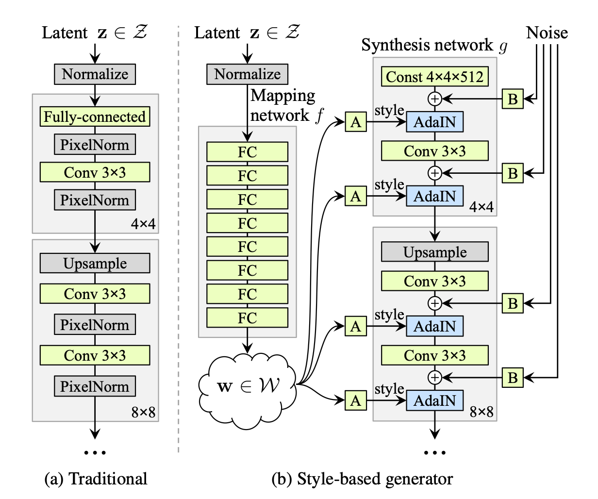

# Style GAN
Implemented the Style GAN Architecture as proposed in <a href="https://arxiv.org/abs/1812.04948">this paper</a>. 

## Details of Architecture

- It consists of a mapping network $f$ to learn a disentangled latent space. A disentangled latent space enables the possibility to find direction vectors that correspond to indvidual factors of variation.
- The synthesis netwok $g$ performs style-mixing. Further, we add random Gaussian Noise to each block as a means to generate stochastic detail.
- Adaptive Instance Normalization is used in each block due to its efficiency and compact representation.